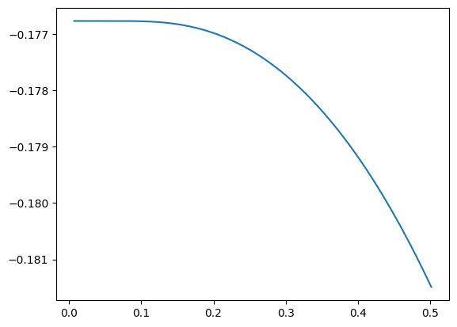
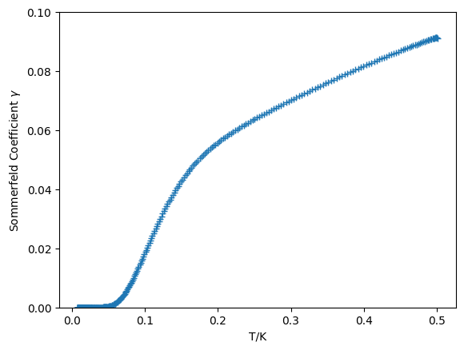
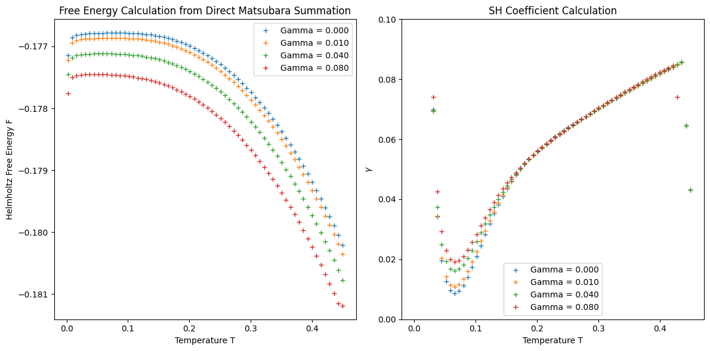
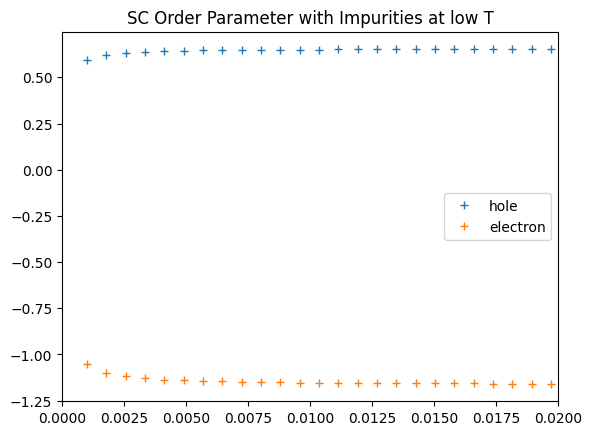
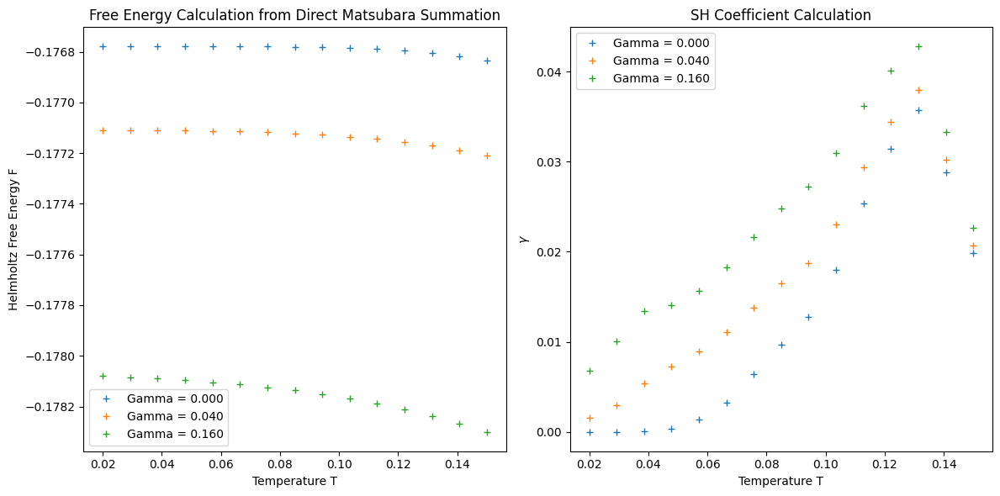
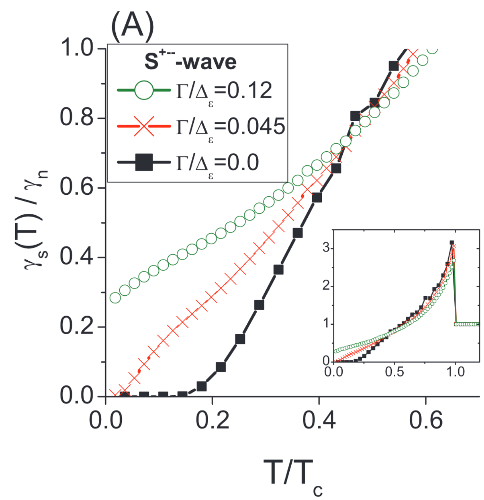
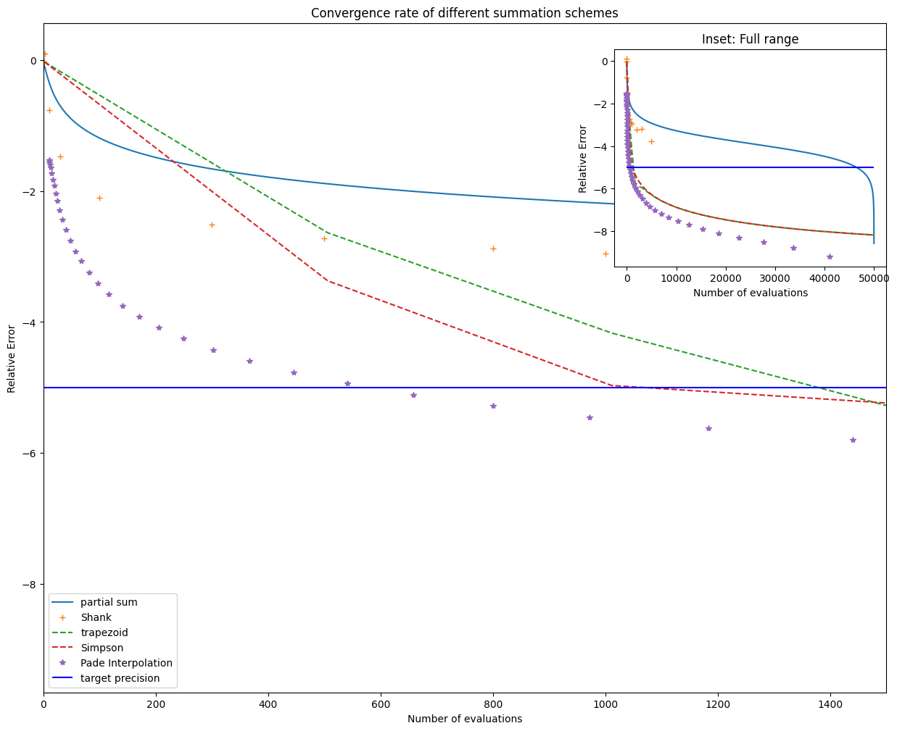

# 15 Aug - 21 Aug Summary
## Mean-field free energy 
$$ F = - T \sum_{\alpha} N_\alpha(0) \int_{-\omega_{AFM}}^{\omega_{AFM}} \mathrm{d}\varepsilon\sum_{i \omega_n} \ln \left[\tilde{\omega}_n^2 + \tilde{\Delta}_\alpha^2 + \varepsilon^2 \right] + \sum_{\alpha, \beta} V_{\alpha, \beta} \bar{A}_\alpha A_{\beta} $$

The matsubara sum diverges and is hard to regularise (intuitively I think there is a way to do this, just I don't know it), but we can perturbatively expand it and regularise the unperturbed term through contour integration (or equivalently, analytic continuation of $\zeta$ function): 
$$\sum_{i \omega_n} \ln(\tilde{\omega}_n^2 + \tilde{\Delta}_n^2 + \varepsilon^2) 
= \sum_{i \omega_n} \ln(\omega_n^2 + \Delta_n^2 + \varepsilon^2) + \sum_{\omega_n}\frac{2 (\Delta (\delta \omega_n) + \omega_n (\delta \Delta))}{\Delta^2 + \omega_n^2 + \varepsilon^2} + \sum_{\omega_n} \frac{1}{(\omega_n^2 + \varepsilon^2 + \Delta^2)^2} \left[ (\Delta^2 + \varepsilon^2 - \omega_n^2) \delta \omega_n^2 + (-\Delta^2 + \varepsilon^2 + \omega_n^2) \delta \Delta^2 - (4 \Delta \omega_n) \delta \omega_n \delta \Delta\right] + \mathcal{O}(\delta^3) $$
where the first term can be renormalised to be 
$$ \sum_{i \omega_n} \ln(\omega_n^2 + \Delta_n^2 + \varepsilon^2) = 2 \ln(2 \cosh(\beta \sqrt{\Delta^2 + \varepsilon^2}/2))$$

Note that since $\delta \omega_n$ is odd and $\delta \Delta$ is even, the first-order correction is zero. Note that a finite truncation does NOT work at all: lhs and rhs look drastically different on a plot, don't really know how they become the same under regularisation. 

## Results: A clean superconductor (last week)
In this case, the Matsubara sum can always be analytically evaluated. 
### F against temperature 

### SH coefficient against temperature

## Results: With impurity scattering

Intermediate T agrees nicely, but lost the low-T behaviour due to insufficient numbers of Matsubara frequencies being included, can be traced back to the order parameters 

note the kink at low T is not expected (this is Gamma = 0)

To recover the low-T behaviour, include more Matsubara frequencies for $T < 0.1K$ such that the maximum Matsubara frequency is about $6500,$ hence including more Matsubara points as $T \rightarrow 0.$

compare this to Bang2017. Qualitative similarities, including exponential growth and zero intercept at low impurity level, roughly linear and non-zero intercept at high impurity. Missing: Quantitative comparison, normalise to the normal-state heat capacity and $T/T_c$ on x-axis. 

## Faster Matsubara Sum
Want to solve the self-consistent equations at as few points as possible. Here are a few possible schemes (10,000 evaluations takes 1 minute). Tested a few scheme using the T = 0.02, Gamma = 0.16 Matsubara sum in SC susceptibility. 

1. Naive partial sum $S_N$
2. Compute n terms and do an n-th order **Shank transformation** that boosts convergence.

However, this algorithm is computationally costly. The most efficient algorithm is an iterative $\mathcal{O}(n^2)$ one. Also, poor convergence beyond $n = 300.$

3. Partial sum up to $n,$ then approximate the rest with numerical integration 

    i. by taking $n$ samples from the leftover and do a trapezoidal / Simpson sum.

    ii. by taking $k$ samples from the leftover (k much smaller, usually <10 is enough), do a Pade interpolation, then integrate using Gaussian quadrature 

## Problems
1. The number of Matsubara frequencies needed to enforce convergence is surprisingly large.

Since $\gamma = C / T,$ it is very sensitive to small changes in the order parameter at low temperature. Now, the maximum matsubara frequency *needed* is about $\omega_0^{\mathrm{max}} = 6500,$ which is huge compared to the AFM cut-off frequency $\omega_c = 10,$ bearing in mind the $\mathcal{O}(n^{-2})$ asymptotic behaviour. Both cutoffs are much larger than the typical energy scale $\mathcal{O}(1).$ 

2. I naively assumed self-energy correction is intraband only and does not affect the second term in free energy (O.P. term).

This is certainly wrong, but somehow it is close enough to give me a plausible answer. In the Bang paper, the self-energy correction has contribution from both bands. Importantly, the unconventional behaviours in an $s^{\pm}$ superconductor is due to 'near cancellation of $G_h^1 + G_e^1$ (Bang2017),' but this conbination is not present in my theory. Up until this point, I have been solving for the self-energy correction and order parameters using the Bang formalism, but calculating the free energy using my combination of a 2-band mean field theory and a 1-band T-matrix formalism.

Moreover, people seem to omit my second term when deriving the Green's function etc., even though it's present in the Hamiltonian.

3. Is the perturbation small? 

Can be assessed by finding out the magnitude of higher-order (4th upwards) correction. in the large $\Gamma,$ low $T$ limit.  But the fractional correction to renormalised frequencies are quite significant at $T = 2mK,$ $\Gamma = 0.08.$

4. The form of the free energy depends (a lot) on the absolute value of DoS on the Fermi surface, not just the ratio $n_h / n_e,$ as $N(0)$ determines the weight between the first and second term in the mean-field Hamiltonian.
## The way forward
1. Explore the Pade decomposition in Han2017, that takes only 50 evaluations to get to the desired precision. Test with a Lorentzian sum to infinity.

2. Implement the Pade_quadrature (it doesn't need evalution at non-Matsubara frequencies) and Pade decomposition methods on the 2-band superconductor with impurity (evaluating at non-Matsubara frequencies should be fine, though, as this is still on the imaginary axis, so worst case senario could evaluate at Matsubara frequencies, do a Pade interpolation then sum over non-Matsubara frequencies). Replace the Matsubara sum in both self-consisten equations and free-energy calculation. 

3. plot $\gamma(T_{min})$ against $\Gamma.$ At each $\Gamma,$ only 5 points near $T_{min}$ are needed for a faithful 2nd derivative calculation. Maybe fit experimental data to it? Explore the parameters V, Gamma, H, N, n

4. Rederive free energy expression to account for interband self-energy correction.
5. Simulate $\gamma(H)$, the volovik SH coefficient under mean-field theory. 
