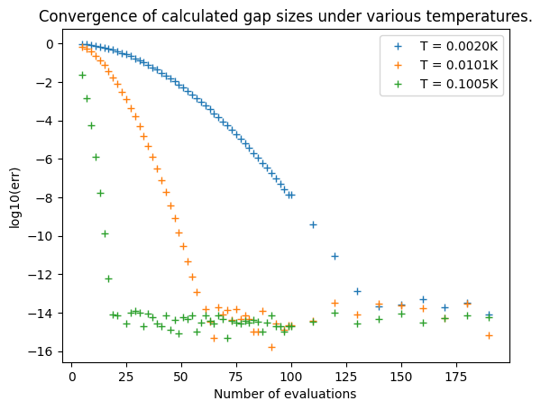
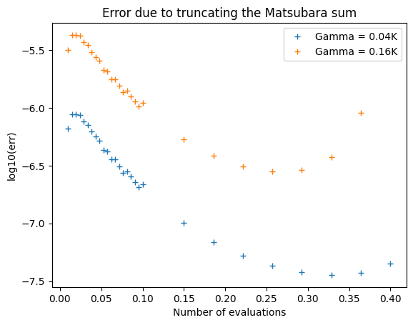
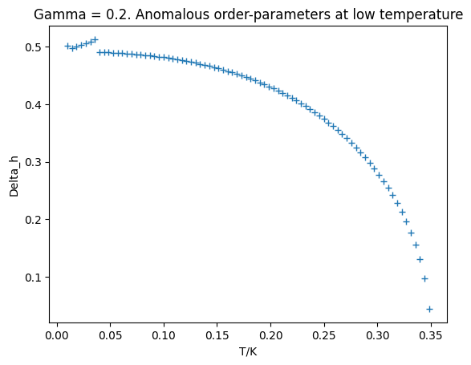
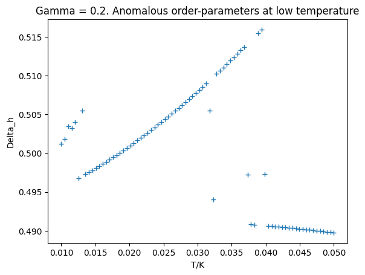
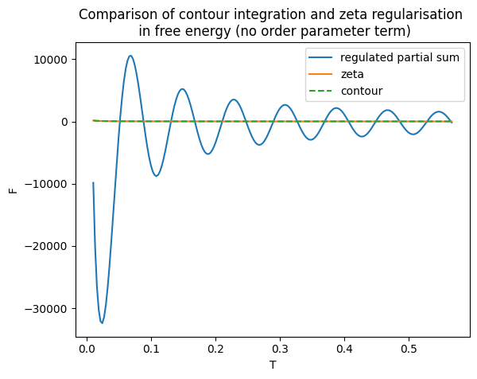
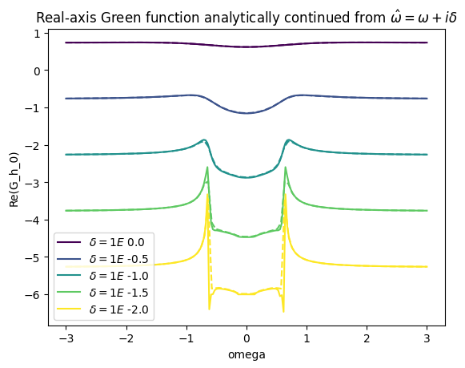

# 22 Aug - 11 Sept Summary
## Solving the Gap Equation from Pade Decomposition
Based on a continued fraction representation of the Fermi-Dirac distribution (Ozaki2007), we can *replace* a Matsubara summation with uniform weights over evenly distributed poles by a scheme which has greater weights and sparser poles at high frequencies in order to force convergence at a much faster rate. 
$$\sum_{i\omega_n}^{\infty}g(i \omega_n) = \sum_{j = -N_P}^{N_P} \eta_j g(i \xi_j)$$

The poles and weights are found from a generalised eigenvalue problem with time complexity $\mathcal{O}(N^3)$ but is universal. As a reference, taking the inverse of a 1000*1000 matrix takes about 70s. 

Previously, summing over 10,000 terms gives $10^{-4}$ precision, whereas in the new scheme we reach the machine precision of double floats within a few hundred terms for the $\Gamma = 0$ case. This precision is significantly worse for non-zero $\Gamma,$ though I suspect this is because we use the solution for $\Gamma = 0$ as an initial guess. A viable method might be to start solving for the order parameter from $T_c$ where it is small, then work our way down to $T = 0,$ using the precious iteration as an initial guess. This could work better for large $\Gamma > 0.16.$ For $\Gamma < 0.16 $ and $T/T_c > 2\%,$ we can ensure a precision better than $10^{-5}$ by using a smart truncation method that uses $50$ terms for $T/T_c > 20\%,$ $400$ terms for $T/T_c = 2\%$ and with a linear interpolation in $1/T$ for temperatures in between. The benchmark of this method is shown below

Furthermore, we have several low-temperature anomalies for large $\Gamma.$ There are unexpected jumps at seemingly random temperatures, accompanied by ill convergence of the root-finding algorithm. maybe can be resolved by using a different method? These jumps are insensitive to the number of Pade decomposition points used and the initial conditions, so they are kind of real... But there are much too many jumps for this to be physical. 

Trying to see if better initial conditions makes the root-finding faster and more precise. If so, then we can store their approximate values in a list.

Sadly, using better initial conditions does not help find more precise solutions: they purely depend on the number of Pade decomposition terms being used. It does improve the root-finding algorithm by about three fold for T near Tc, but we usually don't care about high-T behaviours anyway. In a for loop from Tc to Tmin, the saved time only amounts to about 20.% With smartTruncate, the high-T gap takes about 0.1 seconds to compute (50 evaluations). A loop of 80 temperatures from Tc to Tmin takes about 25 seconds to compute (0.3s per evaluation). 

## Regularise the Matsubara sum
I attempted to regularise the Matsubara sum with a complex phase, as is needed in the contour integration
$$F = \sum_{i \omega_n} \ln(\omega_n^2 + \varepsilon^2 + \Delta^2) \exp(i \omega_n \delta)$$
and compare the results to the analytically regularised expression (zeta or contour integration regularisation, both are the same). 

The following figure is calculated using a fixed number of Matsubara terms at each temperature (maxN = 1e6) and $\delta = 1e-2.$ 
The low-temperature divergence is clear, but there is hope that some convergence can be realised at higher temperature (now there isn't). 

Amplitude of the oscillation increase as $\delta$ decrease, and at some point it goes to the unregulated limit; A larger maxN or a larger $\delta$ gives larger oscillation frequency.

## Evaluating the real-axis Green's function
Here we first solve for the order parameters under FPade Matsubara formalism, given which we can solve for the Green's function at an arbitrary complex frequency $\omega$ without doing any Matsubara summation. Hence, we solve for the Green's function at frequency close to the real axis $\hat{\omega} = \omega + i \delta,$ do a Pade approximation, and analitically continue it to the real axis. However, it is found that the analytically continued results still greatly reflects the original Green's function, hence doesn't converge as claimed in the Schmalian paper. This is also computationally expensive, costing 2 seconds to find the Green's function assuming we use 50 points for Pade approximation. Nontheless, this can be used as a cross check for the free energy. 

