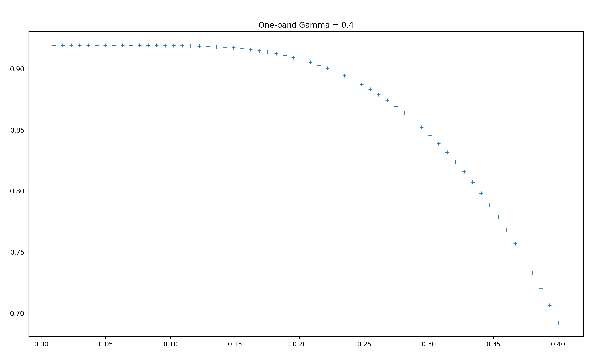
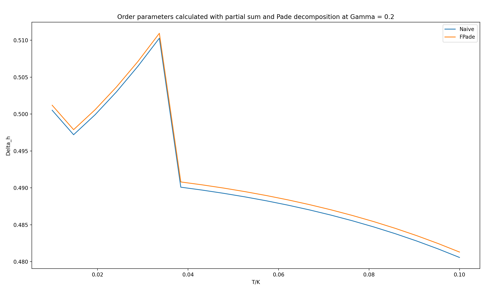

Need to calculate normal state SH coefficient, and zoom-in to low-T regions

Zoomed into low-T. At large $\Gamma,$ $\gamma$ has a negative slope at small $T,$ which doesn't seem physical. 

The low-T kinks in high Gamma gaps are purely numerical, as the naive Matsubara formalism does't have this problem. But it is concerning that including more points into the Pade decomposition scheme doesn't solve the problem. 

## Anomaly at high $\Gamma$
We don't have the same kink at large $\Gamma$ in a one-band superconductor, so it could be a multi-band feature, except it would be more convincing to confirm with Matsubara summation for a two-band system. 

However, we didn't see the same kink using naive Matsubara sum even at higher $\Gamma.$ Therefore, the kinks are simply numerical artifacts.

    
    

Similar 'phase transition' occurs when increasing N_Fpade, making it explicit that this is a numerical instability, but we don't know what caused this. When the root finding algorithm reports ill convergence, the result is very sensitive to N_FPade, showing random scattering and phase transition at Gamma = 0.2, temp = 0.0374. But all the values reported by the decomposition formalism are significantly smaller than the Matsubara sum. But it could also be that 10k terms are not enough in the Matsubara sum. 

It seems like with N_Fpade = 500, there is only one temperature at which the root finding algorithm reports poor convergence, at which the order parameter takes a jump up. 

Actually, it shows up in both cases, so could be a multiband thing. 

Output Log of the above run. 

Delta at T=0:  [ 0.65702129 -1.16405568]
DeltaOut: [0.48057285289223167, -0.8457648992194513]
0 out of 20 Gamma values completed. Cumulative time: 0:01:49.378000.
DeltaOut: [0.4817327985506706, -0.8481542427609733]
1 out of 20 Gamma values completed. Cumulative time: 0:03:41.668217.
DeltaOut: [0.4828060653216452, -0.8503562832932576]
2 out of 20 Gamma values completed. Cumulative time: 0:05:18.907224.
DeltaOut: [0.48379644502165553, -0.8523785640871558]
3 out of 20 Gamma values completed. Cumulative time: 0:07:04.897379.
DeltaOut: [0.4847082301159036, -0.8542298908506508]
4 out of 20 Gamma values completed. Cumulative time: 0:08:52.073880.
c:\Users\tcsxx\OneDrive - University of Cambridge\2024 QM Summer Project\Superconductivity_numerics\Python Scripts\two-band-superconductor\gapeqn_library.py:323: RuntimeWarning: The iteration is not making good progress, as measured by the
  improvement from the last ten iterations.
  TildesOut = fsolve(Eqn,[omega,Delta_h,Delta_e],xtol=1e-12);
DeltaOut: [0.4855458501783483, -0.8559196723157987]
5 out of 20 Gamma values completed. Cumulative time: 0:10:42.044017.
DeltaOut: [0.48631388503903067, -0.8574579095676993]
6 out of 20 Gamma values completed. Cumulative time: 0:13:06.726882.
DeltaOut: [0.4870168206298655, -0.8588547142897607]
7 out of 20 Gamma values completed. Cumulative time: 0:15:10.527654.
DeltaOut: [0.48765904306572594, -0.8601202272088685]
8 out of 20 Gamma values completed. Cumulative time: 0:17:24.188812.
DeltaOut: [0.4882448673115614, -0.8612645790017017]
9 out of 20 Gamma values completed. Cumulative time: 0:19:48.989733.
DeltaOut: [0.48877816110024186, -0.8622971276482305]
10 out of 20 Gamma values completed. Cumulative time: 0:22:35.925478.
DeltaOut: [0.489262360042332, -0.8632263805607032]
11 out of 20 Gamma values completed. Cumulative time: 0:25:49.401019.
DeltaOut: [0.48970029385832836, -0.8640595964028629]
12 out of 20 Gamma values completed. Cumulative time: 0:29:00.022394.
DeltaOut: [0.4900941494290154, -0.8648026554019138]
13 out of 20 Gamma values completed. Cumulative time: 0:32:32.838036.
c:\Users\tcsxx\OneDrive - University of Cambridge\2024 QM Summer Project\Superconductivity_numerics\Python Scripts\two-band-superconductor\gapeqn_library.py:323: RuntimeWarning: The iteration is not making good progress, as measured by the
  improvement from the last five Jacobian evaluations.
  TildesOut = fsolve(Eqn,[omega,Delta_h,Delta_e],xtol=1e-12);
c:\Users\tcsxx\OneDrive - University of Cambridge\2024 QM Summer Project\Superconductivity_numerics\Python Scripts\two-band-superconductor\gapeqn_library.py:159: RuntimeWarning: The iteration is not making good progress, as measured by the
  improvement from the last ten iterations.
  DeltaOut = fsolve(wrapper_SelfConsEqn,Delta0,xtol=1e-13);
c:\Users\tcsxx\OneDrive - University of Cambridge\2024 QM Summer Project\Superconductivity_numerics\Python Scripts\two-band-superconductor\gapeqn_library.py:285: RuntimeWarning: The iteration is not making good progress, as measured by the
  improvement from the last ten iterations.
  DeltaOut = fsolve(wrapper_SelfConsEqn,Delta0,xtol=1e-13);
  DeltaOut = fsolve(wrapper_SelfConsEqn,Delta0,xtol=1e-13);
DeltaOut: [0.5102837674221903, -0.901612000144975]
14 out of 20 Gamma values completed. Cumulative time: 0:41:10.464057.
DeltaOut: [0.5064802797033087, -0.8944598080948396]
15 out of 20 Gamma values completed. Cumulative time: 0:50:20.427935.
DeltaOut: [0.5030138676073223, -0.8880094316997819]
  DeltaOut = fsolve(wrapper_SelfConsEqn,Delta0,xtol=1e-13);
DeltaOut: [0.5102837674221903, -0.901612000144975]
14 out of 20 Gamma values completed. Cumulative time: 0:41:10.464057.
DeltaOut: [0.5064802797033087, -0.8944598080948396]
15 out of 20 Gamma values completed. Cumulative time: 0:50:20.427935.
  DeltaOut = fsolve(wrapper_SelfConsEqn,Delta0,xtol=1e-13);
DeltaOut: [0.5102837674221903, -0.901612000144975]
  DeltaOut = fsolve(wrapper_SelfConsEqn,Delta0,xtol=1e-13);
  DeltaOut = fsolve(wrapper_SelfConsEqn,Delta0,xtol=1e-13);
  DeltaOut = fsolve(wrapper_SelfConsEqn,Delta0,xtol=1e-13);
  DeltaOut = fsolve(wrapper_SelfConsEqn,Delta0,xtol=1e-13);
  DeltaOut = fsolve(wrapper_SelfConsEqn,Delta0,xtol=1e-13);
  DeltaOut = fsolve(wrapper_SelfConsEqn,Delta0,xtol=1e-13);
DeltaOut: [0.5102837674221903, -0.901612000144975]
14 out of 20 Gamma values completed. Cumulative time: 0:41:10.464057.
DeltaOut: [0.5064802797033087, -0.8944598080948396]
15 out of 20 Gamma values completed. Cumulative time: 0:50:20.427935.
DeltaOut: [0.5030138676073223, -0.8880094316997819]
16 out of 20 Gamma values completed. Cumulative time: 1:04:51.679731.
DeltaOut: [0.49990453871894175, -0.8822955072619657]
17 out of 20 Gamma values completed. Cumulative time: 1:16:26.886808.
DeltaOut: [0.49720380128813807, -0.8773970656858366]
18 out of 20 Gamma values completed. Cumulative time: 1:40:52.285719.
DeltaOut: [0.5005178412106983, -0.8834657896569384]
19 out of 20 Gamma values completed. Cumulative time: 2:07:14.579862.
Delta_h_list:[0.48057285289223167, 0.4817327985506706, 0.4828060653216452, 0.48379644502165553, 0.4847082301159036, 0.4855458501783483, 0.48631388503903067, 0.4870168206298655, 0.48765904306572594, 0.4882448673115614, 0.48877816110024186, 0.489262360042332, 0.48970029385832836, 0.4900941494290154, 0.5102837674221903, 0.5064802797033087, 0.5030138676073223, 0.49990453871894175, 0.49720380128813807, 0.5005178412106983]
Delta_e_list:[-0.8457648992194513, -0.8481542427609733, -0.8503562832932576, -0.8523785640871558, -0.8542298908506508, -0.8559196723157987, -0.8574579095676993, -0.8588547142897607, -0.8601202272088685, -0.8612645790017017, -0.8622971276482305, -0.8632263805607032, -0.8640595964028629, -0.8648026554019138, -0.901612000144975, -0.8944598080948396, -0.8880094316997819, -0.8822955072619657, -0.8773970656858366, -0.8834657896569384]