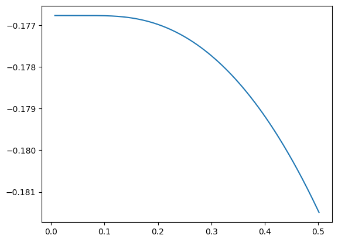
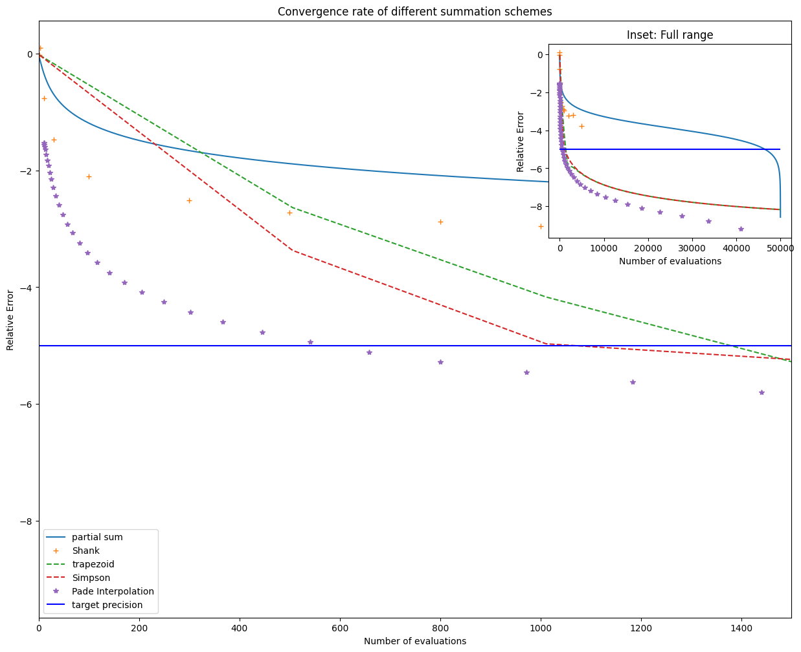
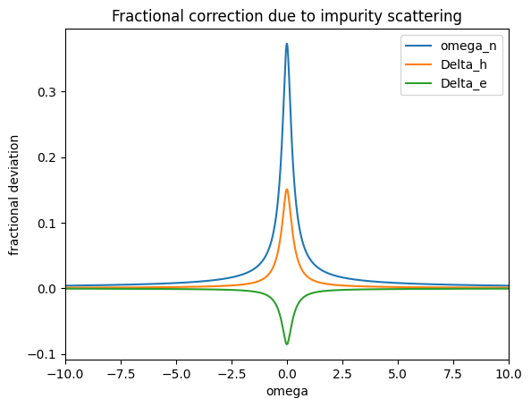
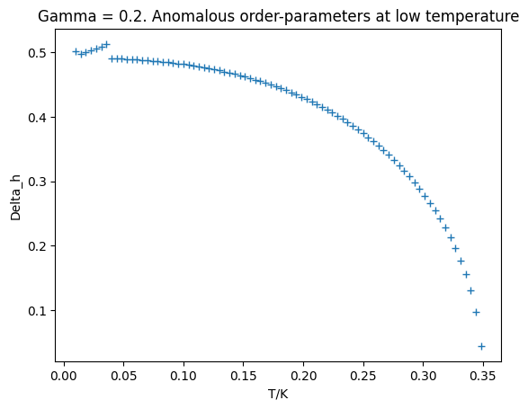
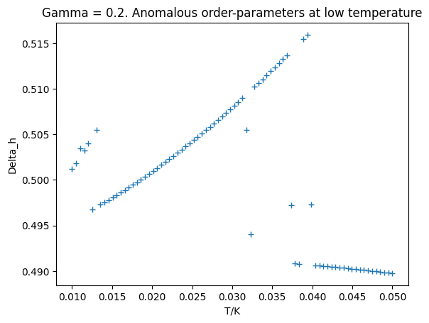
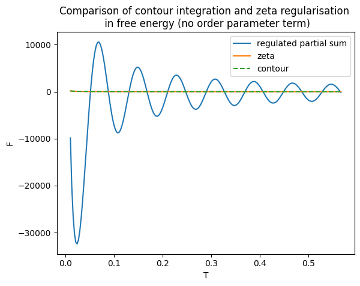

# Diary
A log of ideas and attempts for the two-band s+- superconductor simulation (in chronological order). The most transferrable part of the code is probably the Pade decomposition implementation (Han2017), which greatly accelerates solving the gap equations by sparse sampling. The rest is developing a free energy expansion that allows access to thermodynamical quantities without analytical continuation from the real axis. Divergent behaviours emerge at low temperature and high impurity, whose nature I cannot decipher. 

## Mean-field free energy 
$$ F = - T \sum_{\alpha} N_\alpha(0) \int_{-\omega_{AFM}}^{\omega_{AFM}} \mathrm{d}\varepsilon\sum_{i \omega_n} \ln \left[\tilde{\omega}_n^2 + \tilde{\Delta}_\alpha^2 + \varepsilon^2 \right] + \sum_{\alpha, \beta} V_{\alpha, \beta} \bar{A}_\alpha A_{\beta} $$

The matsubara sum diverges and is hard to regularise (intuitively I think there is a way to do this, just I don't know it), but we can perturbatively expand it and regularise the unperturbed term through contour integration (or equivalently, analytic continuation of $\zeta$ function): 
$$\sum_{i \omega_n} \ln(\tilde{\omega}_n^2 + \tilde{\Delta}_n^2 + \varepsilon^2) 
= \sum_{i \omega_n} \ln(\omega_n^2 + \Delta_n^2 + \varepsilon^2) + \sum_{\omega_n}\frac{2 (\Delta (\delta \omega_n) + \omega_n (\delta \Delta))}{\Delta^2 + \omega_n^2 + \varepsilon^2} + \sum_{\omega_n} \frac{1}{(\omega_n^2 + \varepsilon^2 + \Delta^2)^2} \left[ (\Delta^2 + \varepsilon^2 - \omega_n^2) \delta \omega_n^2 + (-\Delta^2 + \varepsilon^2 + \omega_n^2) \delta \Delta^2 - (4 \Delta \omega_n) \delta \omega_n \delta \Delta\right] + \mathcal{O}(\delta^3) $$
where the first term can be renormalised to be 
$$ \sum_{i \omega_n} \ln(\omega_n^2 + \Delta_n^2 + \varepsilon^2) = 2 \ln(2 \cosh(\beta \sqrt{\Delta^2 + \varepsilon^2}/2))$$

Note that since $\delta \omega_n$ is odd and $\delta \Delta$ is even, the first-order correction is zero. Note that a finite truncation does NOT work at all: lhs and rhs look drastically different on a plot, don't really know how they become the same under regularisation. 

## Results: A clean superconductor (last week)
In this case, the Matsubara sum can always be analytically evaluated. 
### F against temperature 

### SH coefficient against temperature

## Results: With impurity scattering

Intermediate T agrees nicely, but lost the low-T behaviour due to insufficient numbers of Matsubara frequencies being included, can be traced back to the order parameters 

note the kink at low T is not expected (this is Gamma = 0)

To recover the low-T behaviour, include more Matsubara frequencies for $T < 0.1K$ such that the maximum Matsubara frequency is about $6500,$ hence including more Matsubara points as $T \rightarrow 0.$

compare this to Bang2017. Qualitative similarities, including exponential growth and zero intercept at low impurity level, roughly linear and non-zero intercept at high impurity. Missing: Quantitative comparison, normalise to the normal-state heat capacity and $T/T_c$ on x-axis. 

## Faster Matsubara Sum
Want to solve the self-consistent equations at as few points as possible. Here are a few possible schemes (10,000 evaluations takes 1 minute). Tested a few scheme using the T = 0.02, Gamma = 0.16 Matsubara sum in SC susceptibility. 

1. Naive partial sum $S_N$
2. Compute n terms and do an n-th order **Shank transformation** that boosts convergence.

However, this algorithm is computationally costly. The most efficient algorithm is an iterative $\mathcal{O}(n^2)$ one. Also, poor convergence beyond $n = 300.$

3. Partial sum up to $n,$ then approximate the rest with numerical integration 

    i. by taking $n$ samples from the leftover and do a trapezoidal / Simpson sum.

    ii. by taking $k$ samples from the leftover (k much smaller, usually <10 is enough), do a Pade interpolation, then integrate using Gaussian quadrature 

## Problems
1. The number of Matsubara frequencies needed to enforce convergence is surprisingly large.

Since $\gamma = C / T,$ it is very sensitive to small changes in the order parameter at low temperature. Now, the maximum matsubara frequency *needed* is about $\omega_0^{\mathrm{max}} = 6500,$ which is huge compared to the AFM cut-off frequency $\omega_c = 10,$ bearing in mind the $\mathcal{O}(n^{-2})$ asymptotic behaviour. Both cutoffs are much larger than the typical energy scale $\mathcal{O}(1).$ 

2. I naively assumed self-energy correction is intraband only and does not affect the second term in free energy (O.P. term).

This is certainly wrong, but somehow it is close enough to give me a plausible answer. In the Bang paper, the self-energy correction has contribution from both bands. Importantly, the unconventional behaviours in an $s^{\pm}$ superconductor is due to 'near cancellation of $G_h^1 + G_e^1$ (Bang2017),' but this conbination is not present in my theory. Up until this point, I have been solving for the self-energy correction and order parameters using the Bang formalism, but calculating the free energy using my combination of a 2-band mean field theory and a 1-band T-matrix formalism.

Moreover, people seem to omit my second term when deriving the Green's function etc., even though it's present in the Hamiltonian.

3. Is the perturbation small? 

Can be assessed by finding out the magnitude of higher-order (4th upwards) correction. in the large $\Gamma,$ low $T$ limit.  But the fractional correction to renormalised frequencies are quite significant at $T = 2mK,$ $\Gamma = 0.08.$

4. The form of the free energy depends (a lot) on the absolute value of DoS on the Fermi surface, not just the ratio $n_h / n_e,$ as $N(0)$ determines the weight between the first and second term in the mean-field Hamiltonian.
## The way forward
1. Explore the Pade decomposition in Han2017, that takes only 50 evaluations to get to the desired precision. Test with a Lorentzian sum to infinity.

2. Implement the Pade_quadrature (it doesn't need evalution at non-Matsubara frequencies) and Pade decomposition methods on the 2-band superconductor with impurity (evaluating at non-Matsubara frequencies should be fine, though, as this is still on the imaginary axis, so worst case senario could evaluate at Matsubara frequencies, do a Pade interpolation then sum over non-Matsubara frequencies). Replace the Matsubara sum in both self-consisten equations and free-energy calculation. 

3. plot $\gamma(T_{min})$ against $\Gamma.$ At each $\Gamma,$ only 5 points near $T_{min}$ are needed for a faithful 2nd derivative calculation. Maybe fit experimental data to it? Explore the parameters V, Gamma, H, N, n

4. Rederive free energy expression to account for interband self-energy correction.
5. Simulate $\gamma(H)$, the volovik SH coefficient under mean-field theory. 

## Solving the Gap Equation from Pade Decomposition
Based on a continued fraction representation of the Fermi-Dirac distribution (Ozaki2007), we can *replace* a Matsubara summation with uniform weights over evenly distributed poles by a scheme which has greater weights and sparser poles at high frequencies in order to force convergence at a much faster rate. 
$$\sum_{i\omega_n}^{\infty}g(i \omega_n) = \sum_{j = -N_P}^{N_P} \eta_j g(i \xi_j)$$

The poles and weights are found from a generalised eigenvalue problem with time complexity $\mathcal{O}(N^3)$ but is universal. As a reference, taking the inverse of a 1000*1000 matrix takes about 70s. 

Previously, summing over 10,000 terms gives $10^{-4}$ precision, whereas in the new scheme we reach the machine precision of double floats within a few hundred terms for the $\Gamma = 0$ case. This precision is significantly worse for non-zero $\Gamma,$ though I suspect this is because we use the solution for $\Gamma = 0$ as an initial guess. A viable method might be to start solving for the order parameter from $T_c$ where it is small, then work our way down to $T = 0,$ using the precious iteration as an initial guess. This could work better for large $\Gamma > 0.16.$ For $\Gamma < 0.16 $ and $T/T_c > 2\%,$ we can ensure a precision better than $10^{-5}$ by using a smart truncation method that uses $50$ terms for $T/T_c > 20\%,$ $400$ terms for $T/T_c = 2\%$ and with a linear interpolation in $1/T$ for temperatures in between. The benchmark of this method is shown below

Furthermore, we have several low-temperature anomalies for large $\Gamma.$ There are unexpected jumps at seemingly random temperatures, accompanied by ill convergence of the root-finding algorithm. maybe can be resolved by using a different method? These jumps are insensitive to the number of Pade decomposition points used and the initial conditions, so they are kind of real... But there are much too many jumps for this to be physical. 

Trying to see if better initial conditions makes the root-finding faster and more precise. If so, then we can store their approximate values in a list.

Sadly, using better initial conditions does not help find more precise solutions: they purely depend on the number of Pade decomposition terms being used. It does improve the root-finding algorithm by about three fold for T near Tc, but we usually don't care about high-T behaviours anyway. In a for loop from Tc to Tmin, the saved time only amounts to about 20.% With smartTruncate, the high-T gap takes about 0.1 seconds to compute (50 evaluations). A loop of 80 temperatures from Tc to Tmin takes about 25 seconds to compute (0.3s per evaluation). 

## Regularise the Matsubara sum
I attempted to regularise the Matsubara sum with a complex phase, as is needed in the contour integration
$$F = \sum_{i \omega_n} \ln(\omega_n^2 + \varepsilon^2 + \Delta^2) \exp(i \omega_n \delta)$$
and compare the results to the analytically regularised expression (zeta or contour integration regularisation, both are the same). 

The following figure is calculated using a fixed number of Matsubara terms at each temperature (maxN = 1e6) and $\delta = 1e-2.$ 
The low-temperature divergence is clear, but there is hope that some convergence can be realised at higher temperature (now there isn't). 

Amplitude of the oscillation increase as $\delta$ decrease, and at some point it goes to the unregulated limit; A larger maxN or a larger $\delta$ gives larger oscillation frequency.

## Evaluating the real-axis Green's function
Here we first solve for the order parameters under FPade Matsubara formalism, given which we can solve for the Green's function at an arbitrary complex frequency $\omega$ without doing any Matsubara summation. Hence, we solve for the Green's function at frequency close to the real axis $\hat{\omega} = \omega + i \delta,$ do a Pade approximation, and analitically continue it to the real axis. However, it is found that the analytically continued results still greatly reflects the original Green's function, hence doesn't converge as claimed in the Schmalian paper. This is also computationally expensive, costing 2 seconds to find the Green's function assuming we use 50 points for Pade approximation. Nontheless, this can be used as a cross check for the free energy. 

Need to calculate normal state SH coefficient, and zoom-in to low-T regions

Zoomed into low-T. At large $\Gamma,$ $\gamma$ has a negative slope at small $T,$ which doesn't seem physical. 

The low-T kinks in high Gamma gaps are purely numerical, as the naive Matsubara formalism does't have this problem. But it is concerning that including more points into the Pade decomposition scheme doesn't solve the problem. 

## Anomaly at high $\Gamma$
We don't have the same kink at large $\Gamma$ in a one-band superconductor, so it could be a multi-band feature, except it would be more convincing to confirm with Matsubara summation for a two-band system. 

However, we didn't see the same kink using naive Matsubara sum even at higher $\Gamma.$ Therefore, the kinks are simply numerical artifacts.

    
    

Similar 'phase transition' occurs when increasing N_Fpade, making it explicit that this is a numerical instability, but we don't know what caused this. When the root finding algorithm reports ill convergence, the result is very sensitive to N_FPade, showing random scattering and phase transition at Gamma = 0.2, temp = 0.0374. But all the values reported by the decomposition formalism are significantly smaller than the Matsubara sum. But it could also be that 10k terms are not enough in the Matsubara sum. 

It seems like with N_Fpade = 500, there is only one temperature at which the root finding algorithm reports poor convergence, at which the order parameter takes a jump up. 

Actually, it shows up in both cases, so could be a multiband thing. 

Output Log of the above run. 

Delta at T=0:  [ 0.65702129 -1.16405568]
DeltaOut: [0.48057285289223167, -0.8457648992194513]
0 out of 20 Gamma values completed. Cumulative time: 0:01:49.378000.
DeltaOut: [0.4817327985506706, -0.8481542427609733]
1 out of 20 Gamma values completed. Cumulative time: 0:03:41.668217.
DeltaOut: [0.4828060653216452, -0.8503562832932576]
2 out of 20 Gamma values completed. Cumulative time: 0:05:18.907224.
DeltaOut: [0.48379644502165553, -0.8523785640871558]
3 out of 20 Gamma values completed. Cumulative time: 0:07:04.897379.
DeltaOut: [0.4847082301159036, -0.8542298908506508]
4 out of 20 Gamma values completed. Cumulative time: 0:08:52.073880.
c:\Users\tcsxx\OneDrive - University of Cambridge\2024 QM Summer Project\Superconductivity_numerics\Python Scripts\two-band-superconductor\gapeqn_library.py:323: RuntimeWarning: The iteration is not making good progress, as measured by the
  improvement from the last ten iterations.
  TildesOut = fsolve(Eqn,[omega,Delta_h,Delta_e],xtol=1e-12);
DeltaOut: [0.4855458501783483, -0.8559196723157987]
5 out of 20 Gamma values completed. Cumulative time: 0:10:42.044017.
DeltaOut: [0.48631388503903067, -0.8574579095676993]
6 out of 20 Gamma values completed. Cumulative time: 0:13:06.726882.
DeltaOut: [0.4870168206298655, -0.8588547142897607]
7 out of 20 Gamma values completed. Cumulative time: 0:15:10.527654.
DeltaOut: [0.48765904306572594, -0.8601202272088685]
8 out of 20 Gamma values completed. Cumulative time: 0:17:24.188812.
DeltaOut: [0.4882448673115614, -0.8612645790017017]
9 out of 20 Gamma values completed. Cumulative time: 0:19:48.989733.
DeltaOut: [0.48877816110024186, -0.8622971276482305]
10 out of 20 Gamma values completed. Cumulative time: 0:22:35.925478.
DeltaOut: [0.489262360042332, -0.8632263805607032]
11 out of 20 Gamma values completed. Cumulative time: 0:25:49.401019.
DeltaOut: [0.48970029385832836, -0.8640595964028629]
12 out of 20 Gamma values completed. Cumulative time: 0:29:00.022394.
DeltaOut: [0.4900941494290154, -0.8648026554019138]
13 out of 20 Gamma values completed. Cumulative time: 0:32:32.838036.
c:\Users\tcsxx\OneDrive - University of Cambridge\2024 QM Summer Project\Superconductivity_numerics\Python Scripts\two-band-superconductor\gapeqn_library.py:323: RuntimeWarning: The iteration is not making good progress, as measured by the
  improvement from the last five Jacobian evaluations.
  TildesOut = fsolve(Eqn,[omega,Delta_h,Delta_e],xtol=1e-12);
c:\Users\tcsxx\OneDrive - University of Cambridge\2024 QM Summer Project\Superconductivity_numerics\Python Scripts\two-band-superconductor\gapeqn_library.py:159: RuntimeWarning: The iteration is not making good progress, as measured by the
  improvement from the last ten iterations.
  DeltaOut = fsolve(wrapper_SelfConsEqn,Delta0,xtol=1e-13);
c:\Users\tcsxx\OneDrive - University of Cambridge\2024 QM Summer Project\Superconductivity_numerics\Python Scripts\two-band-superconductor\gapeqn_library.py:285: RuntimeWarning: The iteration is not making good progress, as measured by the
  improvement from the last ten iterations.
  DeltaOut = fsolve(wrapper_SelfConsEqn,Delta0,xtol=1e-13);
  DeltaOut = fsolve(wrapper_SelfConsEqn,Delta0,xtol=1e-13);
DeltaOut: [0.5102837674221903, -0.901612000144975]
14 out of 20 Gamma values completed. Cumulative time: 0:41:10.464057.
DeltaOut: [0.5064802797033087, -0.8944598080948396]
15 out of 20 Gamma values completed. Cumulative time: 0:50:20.427935.
DeltaOut: [0.5030138676073223, -0.8880094316997819]
  DeltaOut = fsolve(wrapper_SelfConsEqn,Delta0,xtol=1e-13);
DeltaOut: [0.5102837674221903, -0.901612000144975]
14 out of 20 Gamma values completed. Cumulative time: 0:41:10.464057.
DeltaOut: [0.5064802797033087, -0.8944598080948396]
15 out of 20 Gamma values completed. Cumulative time: 0:50:20.427935.
  DeltaOut = fsolve(wrapper_SelfConsEqn,Delta0,xtol=1e-13);
DeltaOut: [0.5102837674221903, -0.901612000144975]
  DeltaOut = fsolve(wrapper_SelfConsEqn,Delta0,xtol=1e-13);
  DeltaOut = fsolve(wrapper_SelfConsEqn,Delta0,xtol=1e-13);
  DeltaOut = fsolve(wrapper_SelfConsEqn,Delta0,xtol=1e-13);
  DeltaOut = fsolve(wrapper_SelfConsEqn,Delta0,xtol=1e-13);
  DeltaOut = fsolve(wrapper_SelfConsEqn,Delta0,xtol=1e-13);
  DeltaOut = fsolve(wrapper_SelfConsEqn,Delta0,xtol=1e-13);
DeltaOut: [0.5102837674221903, -0.901612000144975]
14 out of 20 Gamma values completed. Cumulative time: 0:41:10.464057.
DeltaOut: [0.5064802797033087, -0.8944598080948396]
15 out of 20 Gamma values completed. Cumulative time: 0:50:20.427935.
DeltaOut: [0.5030138676073223, -0.8880094316997819]
16 out of 20 Gamma values completed. Cumulative time: 1:04:51.679731.
DeltaOut: [0.49990453871894175, -0.8822955072619657]
17 out of 20 Gamma values completed. Cumulative time: 1:16:26.886808.
DeltaOut: [0.49720380128813807, -0.8773970656858366]
18 out of 20 Gamma values completed. Cumulative time: 1:40:52.285719.
DeltaOut: [0.5005178412106983, -0.8834657896569384]
19 out of 20 Gamma values completed. Cumulative time: 2:07:14.579862.
Delta_h_list:[0.48057285289223167, 0.4817327985506706, 0.4828060653216452, 0.48379644502165553, 0.4847082301159036, 0.4855458501783483, 0.48631388503903067, 0.4870168206298655, 0.48765904306572594, 0.4882448673115614, 0.48877816110024186, 0.489262360042332, 0.48970029385832836, 0.4900941494290154, 0.5102837674221903, 0.5064802797033087, 0.5030138676073223, 0.49990453871894175, 0.49720380128813807, 0.5005178412106983]
Delta_e_list:[-0.8457648992194513, -0.8481542427609733, -0.8503562832932576, -0.8523785640871558, -0.8542298908506508, -0.8559196723157987, -0.8574579095676993, -0.8588547142897607, -0.8601202272088685, -0.8612645790017017, -0.8622971276482305, -0.8632263805607032, -0.8640595964028629, -0.8648026554019138, -0.901612000144975, -0.8944598080948396, -0.8880094316997819, -0.8822955072619657, -0.8773970656858366, -0.8834657896569384]